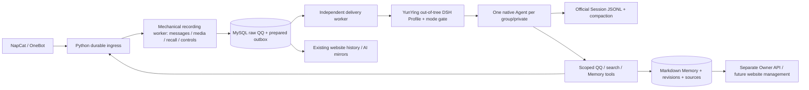

# IGNG Bot V4：云萤运行于 DeepSeek Harness

V4 由一个官方 DSH YunYing Profile、一组仓库外插件/工具/Skill，以及复用 V3 的 Python 基础设施组成。DSH 负责真实 Agent Loop、Tool Runtime、Session、持久 Inbox、附件 admission 和 compaction。没有 DSH fork，没有自建模型循环，没有 `should_reply/reply_text` 协议，没有使用 V3 ContextManager 压缩 V4 上下文。

审查基线：本仓库 `9efc56d`；上游 [DeepSeek Harness](https://github.com/deepseek-ai/deepseek-harness/tree/5badb15009ae1756c3afe0ae0cef1faafc290ccc) `5badb150`，官方已发布包固定 `0.2.1-alpha.1`；[qq-bridge](https://github.com/Derpyu520/qq-bridge/tree/9df6a7e7fc5abcb36793337f778483bd442a3d2d) `9df6a7e7`。这是一组可复现快照，不自动追随上游更新。

## 阅读结论和扩展位置

| 上游层 | 核心实现 | V4 使用方式 |
| --- | --- | --- |
| Profile/Plugin | `apps/cli/src/profile-boot.ts`、`plugin.ts`；app-boot 的 profile bundle/patch 与 package resolution | 官方 `dsh plugin --profile yunying add <package>`；bundle 的 `cordis.patch.yml` 禁用编码工具，挂载 `@igng/yunying-dsh`。 |
| Agent | `packages/core/agent-loop/src/{index,agent,inbox}.ts`、agent registry | `ctx.agents.create/resume`；`inject` 提交当前允许的模型输入，`followup` 唤醒；关闭聊天模式的普通消息仅成为 Social Runtime 观察记录。同一会话保持一个原生 Agent。 |
| Tool | `packages/core/tools` 的 scoped registry、guards、scheduler | 注册 DSH ToolDefinition；继承工具限制为仅官方 `skill`，额外执行 guard 验证实际 Agent 身份、精确工具白名单、会话、令牌、暂停/租约。 |
| Skill | `packages/skill/{skill,tool-skill}` | Memory Skill 在 agent scope 注册；官方 `tool-skill` 保留上游的全局挂载方式；无 filesystem skill provider。 |
| Session | `packages/core/session`、`session-persistence-jsonl`、projection | 原生异步 Persistence `stat/open/read` 与 `sessions.flush`；MySQL 只存映射、事件状态和管理数据。 |
| Compaction | `packages/compaction/compaction-basic`、region/summarizer、token-meter | 保留上游自动压缩与 durable summary 语义；恢复后继续同一 Session；summary 不写入长期 Memory。 |
| reserved2 | donor `src/bridge.js` 的 wake/unread/read-through/wait/finish；原 qq-chat-v2 preset 和 QQ tools | 原 Social Prompt 保持字节与 YAML 折叠语义；动态 wake/reminder 函数体原文；状态与 SQL/native DSH 接口适配。 |

## 会话、队列和发送

`group:<QQ群号>`、`private:<QQ号>` 是稳定会话 key，每个 key 对应一个持久 DSH UUID。允许列表为空时拒绝社交访问。私聊原始历史沿用 V3 的负数 group_id 约定。

WebSocket 来信先落 `yunying_ingress`。机械 worker 复用 V3 下载附件、保存消息、撤回和管理控制，再提交 prepared outbox；独立 delivery worker 才联系 DSH。两阶段各自按会话 FIFO、backoff 和状态恢复。DSH 不在线不会阻塞后续 `message_logs`/附件保存。媒体提交前进程中断时复用已提交的消息行，不重复下载。普通模型文本输出不转发 QQ；带工具调用的中间步骤文本作为过程报告按模型配置转发，配置为无过程输出的模型由固定间隔心跳回退，收尾答复仍只经 qq_send_message 发送。

`group_configs.is_chat_mode` 继续作为网站/QQ 的同一个开关：开启时所有来信可参与原 reserved2 行为；关闭时普通消息只观察，不 inject、不自主 wake，明确 @ 或引用云萤才建立一次调用。该轮带最近最多20条/约6000字符上下文，可继续读取新到达的观察消息和旧历史。个人私聊不受群开关影响。群配置只剩聊天模式一个开关；机械记录始终继续。

许可在事件投递、所有 wake 路径、官方 `agent/pre-step`、工具执行和 Python 发送端收口。关闭模式不会因 bootstrap、pending Inbox、有限 sleep、reply check、提醒、proactive 或恢复而自行启动模型；开关恢复不会自动重放旧积压。真实呼叫的临时权限记录来源 event、最长10分钟，原生 `turn/end` 撤销；模型只能改变 wake 意愿，不能授予聊天权限。切换保持原 Session UUID，旧待处理输入通过官方 Inbox 的取消记录移除，不改 Session 文件。

DSH 插件在 SQL 分配连续 seq，先保存原生 UserMessage ID，再 `inject`、官方 `flush`，最后确认 SQL delivery。恢复时通过官方 read handle 重建已消费和仍排队的 ID；官方正常 `dispose()` 会记录取消待处理 Inbox，因此未消费的 SQL 事件以原 ID重新提交。已经消费的消息不重放。生产不能丢弃 DSH 持久目录后仅用 SQL 映射重新建空会话。

每个 key 的事件接受串行，模型执行使用 DSH 原生串行 loop；运行中到来的消息放入 next-step，不另建 Agent。MySQL 独占租约拒绝第二个 Profile；Python 也持有单消费者锁。租约丢失则停止活动并拒绝工具；Profile heartbeat 或 Python durable worker 失效会退出，由既有容器重启策略恢复。

发送仅通过固定 QQ capability。使用 Session+tool call ID 的持久发送账本；同一调用重试返回已记录结果。远端接受后断线/超时是 `unknown`，不自动重发。纯文本用 OneBot text segment，CQ 字串不执行；引用及 @ 目标限制在当前会话已收到的人/消息。现有 MC 系统通知沿用其原权限和数据源，与模型工具隔离。

## reserved2 baseline

聊天模式开启时保留潜水默认值、指定成员/关键词/@/名字/提问/概率/拍一拍唤醒、有限时间唤醒、主动机会、回复检查、无行动重置与遗漏收尾提醒。普通唤醒限频；直接 @、回复云萤及授权私聊可及时唤醒。

`qq_get_unread_messages`、历史读取、wake 快照与 wait 返回建立“已查看”凭据。`qq_mark_read`/`qq_set_wake_config` 只确认连续安全水位，不能跳过未查看的早期消息或误清新消息。`purpose="reply"` 从最后来信开始计静默，思考时间计入；短静默不替代 300 秒沉睡观察。新消息、发言与重启不会把短等待累计为完整观察。普通文本结束可保持沉默，有限提醒后保留可唤醒默认配置。

完整移植清单、原文 hash 和必要差异见 [donor provenance](../yunying-dsh/donor/qq-bridge/PROVENANCE.md)。高级表情收藏、声线合成、默认形象不属于第一阶段能力；已有媒体收取和显示继续工作。

## 三个独立存储层及数据库变化

| 层 | 权威数据 | 用途 |
| --- | --- | --- |
| Raw QQ | 原 `message_logs`、附件树、撤回状态 | 网站历史、媒体和来源证据；不替代 Agent Session。 |
| Runtime Session | 官方 DSH JSONL/附件持久目录（权威）；MySQL `yunying_session_events` 为过滤投影 | 模型真实运行历史、原生 Inbox、工具结果、request context、compaction；不把 summary 当长期记忆。投影表供查询/还原，可从官方日志重建。 |
| Long-term Memory | MySQL Markdown 文档/版本/来源 | 稳定事实与长期约定；模型受控访问，Owner/未来网站管理。 |

新增：`yunying_sessions`、`yunying_ingress`、`yunying_events`、`yunying_sends`、`yunying_ai_records`、`yunying_session_events`；`memory_identities`、`memory_identity_bindings`、`memory_identity_audit`；`memory_documents`、`memory_versions`、`memory_sources`、`memory_audit`；checksum 迁移登记 `yunying_schema_migrations`。迁移仅增加结构，不删除、重写或导入 V3 context summary。003 在 ingress 增加机械阶段状态、独立重试/时间/错误与命令结果，在 sessions 增加真实呼叫的 event/到期权限；004 增加机械队列索引；008 增加会话事件的过滤投影表；010 把来源链并入 `memory_versions.sources`，身份/绑定/身份审计与访问审计不再被运行时代码使用（退役由受控运维阶段执行）。既有记录回填为已完成机械阶段，已应用001/002保持原 checksum。V4 启动只初始化消息、撤回和群配置，不再初始化/seed 旧摘要和 system Prompt；V3 rollback 初始化器保留。

正式用量继续写既有 `igng_sites.ai_jobs/ai_job_attempts`：每个原生 turn 一个 `social_turn` job，续接和失败重试为 attempts；compaction 是独立 `dsh_compaction` job。任务 key 来自 Session UUID 与原生 turn/compaction ID，request_id 来自 Session UUID 与 event seq。SQL事务和任务锁去重，每次从 attempts 重算总量；provider/cache 用量来自原生事件，未知 usage 的 attempt tokens 为 NULL，job只合计已知值并记录未知次数。模型沉默仍计费。

Token 记账对齐 tokscale 的 DSH 解析：五桶（未命中缓存的 input、扣除 reasoning 的 output、cache read/write、reasoning）与网站既有 prompt/completion/total/cached 四列并存；`source.replayState.response.responseModel` 优先于配置别名；同一 (turn, step) 的后续结算替换前一次（`llm/retry-started` 关闭该槽位），fork 的 `seedLength` 前缀不重复计。真实费用来自 new-api：优先采用其日志里同一请求的 quota，否则用 new-api v1.0.0-rc.31 的结算公式按日志校准过的倍率计算；无凭据/未定价时 cost 为 NULL 并记 `pricing_source`。`scripts/accounting-reconcile.py` 用 tokscale、bot 记账与 new-api 日志三方对账。

`yunying_ai_records` 保存按原生 seq 排序的尝试/任务结束 outbox，网站故障时重试；官方 Session 回放可重建相同键。导出首先按原生 task key 写通用表，独立于 call_log_id；随后兼容写 `call_logs`，供尚未迁移的网站旧调用页读取。历史日志与既有旧镜像 job 保留，不重算过去的0用量。

Memory 分两层，SQL 在匹配、计数、snippet 之前过滤。**群记忆**按会话（`scope_key`）保存，只在本群/本私聊可读；**个人记忆**以 QQ 号（`memory_documents.person_qq`）为基准保存，天然跨群。读取时把最近发言的 QQ 解析到其 IGNG 账号（`igng_sites.user_qqs`，经 Python `/identity` capability），聚合该账号名下全部 QQ 的个人记忆，再叠加当前会话的群记忆；QQ 没有 IGNG 归属时只返回它自己的个人记忆，解析失败按"只看自己"失败关闭。个人记忆来源必须是本人已查看、未撤回的真实消息，正文由服务端引用本人原话生成，禁止模型把别群私有 prose 粘入；来源链随版本保存在 `memory_versions.sources`，跨群结果不返回来源群号。个人身份直接以 QQ 号（`person_qq`）为键，经 `igng_sites.user_qqs` 解析同一 IGNG 账号；不设本地身份表，模型不能绑定或转移身份。

更新使用 `expectedVersion` 乐观锁，版本、hash 与来源在同一事务提交。Forget 对模型隐藏内容，保留受控版本；Owner rollback 创建新版本。Owner secret 与 infrastructure secret 必须分开，默认无 owner endpoint 的 host port。以后网站可直接使用管理 API；本次不改站点仓库或清理用户历史；正式记忆未灌入伪造测试文档。

`yunying_session_events` 是官方 Session 日志的**过滤投影**，不是 durability：JSONL/附件仍是权威与恢复源，投影表可随时用官方日志重建。它保留 turn/step 边界、system/developer/user/assistant 消息、tool 调用（含原始参数）、request 路由与 compaction 摘要，并按设计丢弃可再生的杂碎——助手原始流、工具结果正文（只留 callId/isError/字节数占位）、request 工具 schema、Inbox splice。读写接口、环境开关与重建命令见 [会话投影](v4-session-transcript.md)。

MySQL SessionPersistence provider 仍可作为上游同一异步 capability 的独立 provider 接入，但它会重写 durability，当前不采用。官方 JSONL 保持权威；`persistence_provider` 和 Agent create/resume/flush 接口是扩展边界，投影采集只挂 `session/event` 与恢复回放。

## V3 保留与退出

保留 OneBot/NapCat、parser/forward、DB/history/recall、storage/thumbnail/WebP/视频、网站用户组与管理员权限、MC 通知、调用记录镜像、媒体/frpc/NAS 数据路径。共享 ingress 抽出到 `igngbot_v3/message_ingest.py`，两代复用。附件名和流式体积边界做了小幅加固。

V4 不调用 ChatService、ContextManager、旧 system_prompt_store 或纯文本 LLM client；旧模块只留在显式 V3 回滚入口。源码 `main.py` 默认 V4；`IGNGBOT_RUNTIME=v3` 可回滚。NAS base Dockerfile 保持显式 V3 默认，V4 overlay 才切换现有 bot 服务；开发合并不会自动把生产切到 V4。

## 当前限制

DSH 为固定 alpha 版本，升级需重新跑契约与持久恢复测试。本次已通过既有 build host/NAS 通道构建并部署，实际版本/重启/备份证据见 [NAS部署记录](v4-nas-deployment-20261004.md)。脚本模型/OneBot fixture 验证调度和协议，不能证明真实 QQ、付费模型的自然风格或 NAS 稳定运行。

直接依赖 MySQL/YAML 已使用审计修复版本；`fflate` 固定修复版本。上游发布包仍带 `http-cache-semantics <=4.2.0` 引出的告警；部署时重新执行 inclusive audit 的结果为1 high / 0 critical。[上游公告](https://github.com/advisories/GHSA-ch52-4w7c-c8xp) 当前仍标记 patched versions 为None，而 npm报告 `fixAvailable: true`；未验证可执行的升级路径，不能仅凭该标志声称漏洞已修复。YunYing 禁用遥测和相关工具，不将缓存抓取路径暴露给模型。这不等同于全量依赖安全认证。

当前开发网络把 Bing DNS 解析为 `198.18.0.0/15` Fake-IP，donor 安全抓取正确拒绝；此开发环境不能证明公网搜索；NAS的安全RSS回退已实测返回8条，边界见部署记录。代理部署可明确选上游认证 DeepSeek 搜索 provider；公网抓取仍保留原 SSRF 防护。
