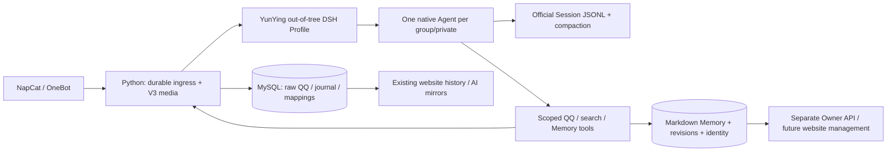

# IGNG Bot V4：云萤运行于 DeepSeek Harness

V4 由一个官方 DSH YunYing Profile、一组仓库外插件/工具/Skill，以及复用 V3 的 Python 基础设施组成。DSH 负责真实 Agent Loop、Tool Runtime、Session、持久 Inbox、附件 admission 和 compaction。没有 DSH fork，没有自建模型循环，没有 `should_reply/reply_text` 协议，没有使用 V3 ContextManager 压缩 V4 上下文。

审查基线：本仓库 `9efc56d`；上游 [DeepSeek Harness](https://github.com/deepseek-ai/deepseek-harness/tree/5badb15009ae1756c3afe0ae0cef1faafc290ccc) `5badb150`，官方已发布包固定 `0.2.1-alpha.1`；[qq-bridge](https://github.com/Derpyu520/qq-bridge/tree/9df6a7e7fc5abcb36793337f778483bd442a3d2d) `9df6a7e7`。这是一组可复现快照，不自动追随上游更新。

## 阅读结论和扩展位置

| 上游层 | 核心实现 | V4 使用方式 |
| --- | --- | --- |
| Profile/Plugin | `apps/cli/src/profile-boot.ts`、`plugin.ts`；app-boot 的 profile bundle/patch 与 package resolution | 官方 `dsh plugin --profile yunying add <package>`；bundle 的 `cordis.patch.yml` 禁用编码工具，挂载 `@igng/yunying-dsh`。 |
| Agent | `packages/core/agent-loop/src/{index,agent,inbox}.ts`、agent registry | `ctx.agents.create/resume`；`inject` 提交每条事件，`followup` 唤醒，同一会话保持一个原生 Agent。 |
| Tool | `packages/core/tools` 的 scoped registry、guards、scheduler | 注册 DSH ToolDefinition；继承工具限制为仅官方 `skill`，额外执行 guard 验证实际 Agent 身份、精确工具白名单、会话、令牌、暂停/租约。 |
| Skill | `packages/skill/{skill,tool-skill}` | Memory Skill 在 agent scope 注册；官方 `tool-skill` 保留上游的全局挂载方式；无 filesystem skill provider。 |
| Session | `packages/core/session`、`session-persistence-jsonl`、projection | 原生异步 Persistence `stat/open/read` 与 `sessions.flush`；MySQL 只存映射、事件状态和管理数据。 |
| Compaction | `packages/compaction/compaction-basic`、region/summarizer、token-meter | 保留上游自动压缩与 durable summary 语义；恢复后继续同一 Session；summary 不写入长期 Memory。 |
| reserved2 | donor `src/bridge.js` 的 wake/unread/read-through/wait/finish；原 qq-chat-v2 preset 和 QQ tools | 原 Social Prompt 保持字节与 YAML 折叠语义；动态 wake/reminder 函数体原文；状态与 SQL/native DSH 接口适配。 |

## 会话、队列和发送

`group:<QQ群号>`、`private:<QQ号>` 是稳定会话 key，每个 key 对应一个持久 DSH UUID。允许列表为空时拒绝社交访问。私聊原始历史沿用 V3 的负数 group_id 约定。

WebSocket 来信先落 `yunying_ingress`，之后才下载附件、OCR/ASR 和提交给 DSH。每条消息都进入 Agent Inbox；唤醒机制决定何时运行，模型行为决定是否发言。普通文本输出不转发 QQ。媒体提交前进程中断时复用已提交的 `message_logs` 行；同一会话队首重试阻止后来消息越过，但其他会话可继续入队。

DSH 插件在 SQL 分配连续 seq，先保存原生 UserMessage ID，再 `inject`、官方 `flush`，最后确认 SQL delivery。恢复时通过官方 read handle 重建已消费和仍排队的 ID；官方正常 `dispose()` 会记录取消待处理 Inbox，因此未消费的 SQL 事件以原 ID重新提交。已经消费的消息不重放。生产不能丢弃 DSH 持久目录后仅用 SQL 映射重新建空会话。

每个 key 的事件接受串行，模型执行使用 DSH 原生串行 loop；运行中到来的消息放入 next-step，不另建 Agent。MySQL 独占租约拒绝第二个 Profile；Python 也持有单消费者锁。租约丢失则停止活动并拒绝工具；Profile heartbeat 或 Python durable worker 失效会退出，由既有容器重启策略恢复。

发送仅通过固定 QQ capability。使用 Session+tool call ID 的持久发送账本；同一调用重试返回已记录结果。远端接受后断线/超时是 `unknown`，不自动重发。纯文本用 OneBot text segment，CQ 字串不执行；引用及 @ 目标限制在当前会话已收到的人/消息。现有 MC 系统通知沿用其原权限和数据源，与模型工具隔离。

## reserved2 baseline

保留潜水默认值、指定成员/关键词/@/名字/提问/概率/拍一拍唤醒、有限时间唤醒、主动机会、回复检查、无行动重置与遗漏收尾提醒。普通唤醒限频；直接 @、回复云萤及授权私聊可及时唤醒。

`qq_get_unread_messages`、历史读取、wake 快照与 wait 返回建立“已查看”凭据。`qq_mark_read`/`qq_set_wake_config` 只确认连续安全水位，不能跳过未查看的早期消息或误清新消息。`purpose="reply"` 从最后来信开始计静默，思考时间计入；短静默不替代 300 秒沉睡观察。新消息、发言与重启不会把短等待累计为完整观察。普通文本结束可保持沉默，有限提醒后保留可唤醒默认配置。

完整移植清单、原文 hash 和必要差异见 [donor provenance](../yunying-dsh/donor/qq-bridge/PROVENANCE.md)。高级表情收藏、声线合成、默认形象不属于第一阶段能力；已有媒体收取和显示继续工作。

## 三个独立存储层及数据库变化

| 层 | 权威数据 | 用途 |
| --- | --- | --- |
| Raw QQ | 原 `message_logs`、附件树、撤回状态 | 网站历史、媒体和来源证据；不替代 Agent Session。 |
| Runtime Session | 官方 DSH JSONL/附件持久目录 | 模型真实运行历史、原生 Inbox、工具结果、request context、compaction；不把 summary 当长期记忆。 |
| Long-term Memory | MySQL Markdown 文档/版本/来源/Identity | 稳定事实与长期约定；模型受控访问，Owner/未来网站管理。 |

新增：`yunying_sessions`、`yunying_ingress`、`yunying_events`、`yunying_sends`、`yunying_ai_records`；`memory_identities`、`memory_identity_bindings`、`memory_identity_audit`；`memory_documents`、`memory_versions`、`memory_sources`、`memory_audit`；checksum 迁移登记 `yunying_schema_migrations`。迁移仅添加表与独立 `social_paused` 字段，不删除、重写或导入 V3 context summary。既有 `call_logs` 和站点 `ai_jobs/ai_job_attempts` 复用并以事务+重试去重镜像，记录真实 provider 与 DSH 的 cache/input token 语义，包括 compaction。

Memory 默认 `scope_private`，SQL 在匹配、计数、snippet 之前过滤 scope。跨群 `shared_person` 必须由本人开启 `/记忆共享 开启`，来源必须是已查看的本人真实群消息；服务端生成共享标题和引用 Markdown，禁止模型把别群私有 prose 粘入共享文档。私聊不能升级为共享；跨群结果不返回来源群号。身份按 provider+external_id 唯一绑定；跨平台绑定只可经独立 Owner API，模型不能绑定身份或改共享授权。

更新使用 `expectedVersion` 乐观锁，版本、hash、来源和审计在同一事务提交。Forget 对模型隐藏内容，保留受控审计版本；Owner rollback 创建新版本。Owner secret 与 infrastructure secret 必须分开，默认无 owner endpoint 的 host port。以后网站可直接使用管理 API；本次不改站点仓库或清理用户历史；正式记忆未灌入伪造测试文档。

未来 MySQL SessionPersistence 可作为上游同一异步 capability 的独立 provider 接入。当前 adapter 不读取或修改 JSONL 实体、不自定义 durability；`persistence_provider` 和 Agent create/resume/flush 接口是扩展边界。

## V3 保留与退出

保留 OneBot/NapCat、parser/forward、DB/history/recall、storage/thumbnail/WebP/视频、OCR/ASR、网站用户组与管理员权限、MC 通知、调用记录镜像、媒体/frpc/NAS 数据路径。共享 ingress 抽出到 `igngbot_v3/message_ingest.py`，两代复用。附件名和流式体积边界做了小幅加固。

V4 不调用 ChatService、ContextManager、旧 system_prompt_store 或纯文本 LLM client；旧模块只留在显式 V3 回滚入口。源码 `main.py` 默认 V4；`IGNGBOT_RUNTIME=v3` 可回滚。NAS base Dockerfile 保持显式 V3 默认，V4 overlay 才切换现有 bot 服务；开发合并不会自动把生产切到 V4。

## 当前限制

DSH 为固定 alpha 版本，升级需重新跑契约与持久恢复测试。本次已通过既有 build host/NAS 通道构建并部署，实际版本/重启/备份证据见 [NAS部署记录](v4-nas-deployment-20261004.md)。脚本模型/OneBot fixture 验证调度和协议，不能证明真实 QQ、付费模型的自然风格或 NAS 稳定运行。

直接依赖 MySQL/YAML 已使用审计修复版本；`fflate` 固定修复版本。上游发布包仍带 `http-cache-semantics <=4.2.0` 引出的告警；部署时重新执行 inclusive audit 的结果为1 high / 0 critical。[上游公告](https://github.com/advisories/GHSA-ch52-4w7c-c8xp) 当前仍标记 patched versions 为None，而 npm报告 `fixAvailable: true`；未验证可执行的升级路径，不能仅凭该标志声称漏洞已修复。YunYing 禁用遥测和相关工具，不将缓存抓取路径暴露给模型。这不等同于全量依赖安全认证。

当前开发网络把 Bing DNS 解析为 `198.18.0.0/15` Fake-IP，donor 安全抓取正确拒绝；此开发环境不能证明公网搜索；NAS的安全RSS回退已实测返回8条，边界见部署记录。代理部署可明确选上游认证 DeepSeek 搜索 provider；公网抓取仍保留原 SSRF 防护。
